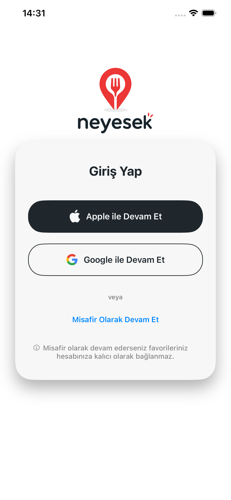
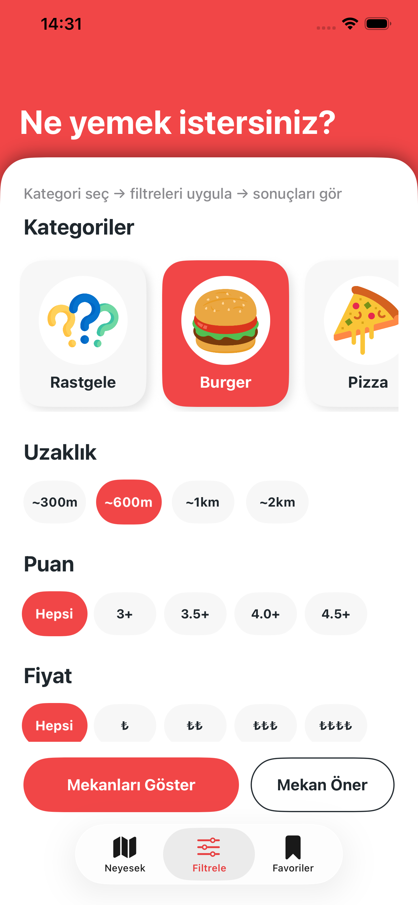
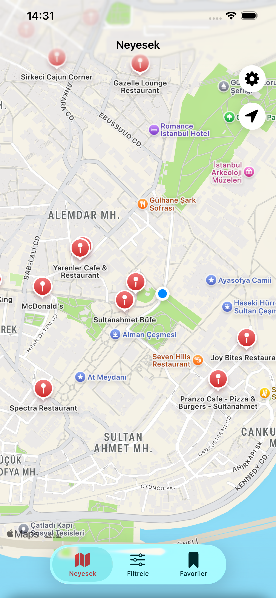
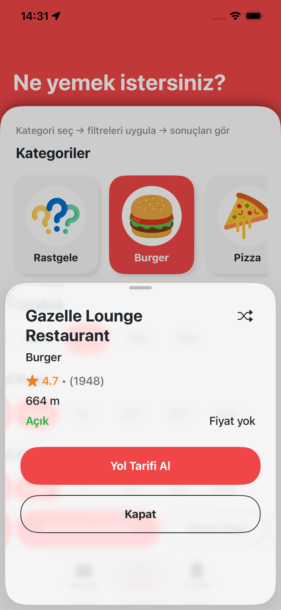
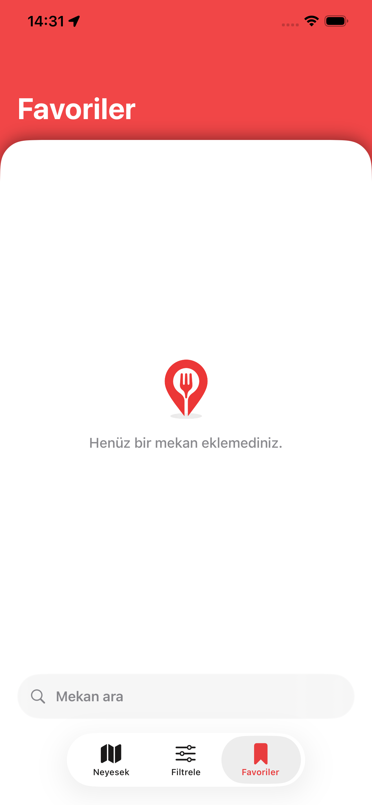

# Neyesek

Neyesek is an iOS application that suggests restaurants based on the user's location. Users can filter places by category, price, rating, and distance, or get a random suggestion.

The app uses Google Places API to fetch place data and Supabase to manage user data such as favorites.

## Features

- List places based on user location  
- Filter by category, price, rating, and distance  
- Random place suggestion  
- Add and remove favorites  
- Show open / closed status  

## Technologies

- Swift  
- UIKit  
- MVVM architecture  
- Google Places API  
- Supabase  
- CoreLocation  

## Security

This project does not include real API keys. It is intended for demo purposes.

## Screenshots

## Architecture

ViewController → ViewModel → Service → API